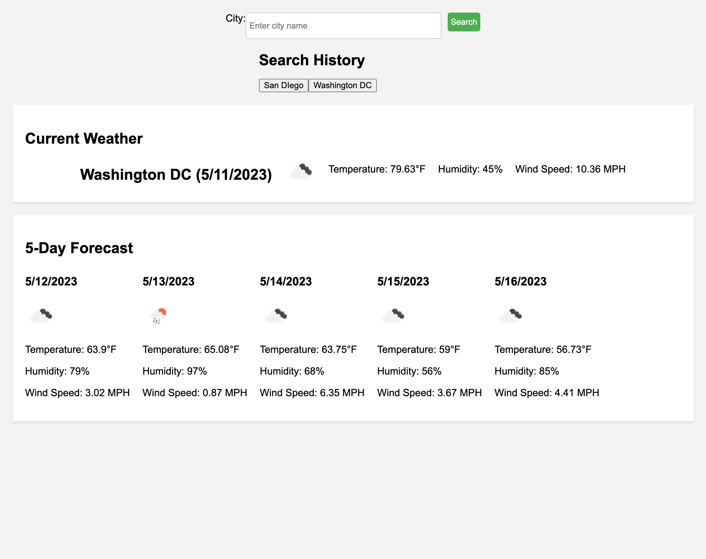

Title: Weather Dashboard Project

Description: This application brings up the weather report based on the city entered in the Input. I used a server side Weather API with openweathermap.org. I faced the challenge of getting my key to work properly and have the information display properly. The icons displaying properly from the API is also an issue and seems to work better in some cities more than others I could have used my own icons but chose to try to draw the information from the API instead. I hope to clean it up a bit more with styling but for now all the functionality seems to be working properly.

How to use: Open up the page type in a city and submit by hitting search or enter.

License: N/A

Link: https://nporter619.github.io/Weather-Dashboard-Project/

Screenshot: 